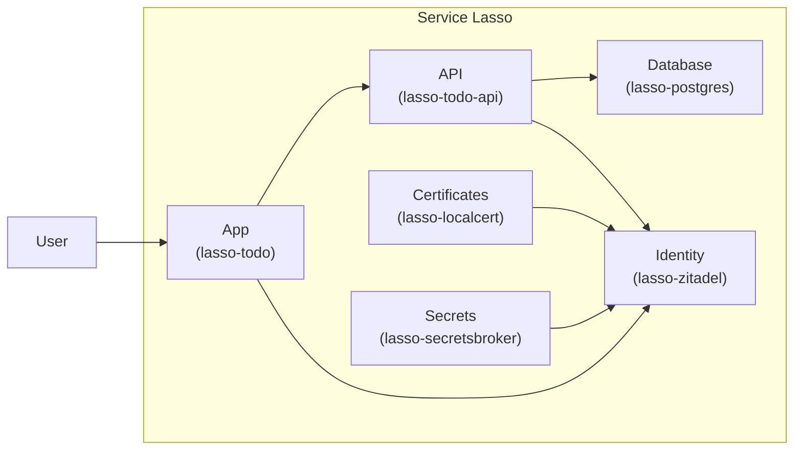

# 4 — Add single sign-on

[Previous](../03-api/README.md) · [Next](../05-desktop/README.md) · [Article](https://service-lasso.github.io/service-lasso/getting-started/zitadel-sso-hub)

Identity and dedicated certificates join the API stack. App login uses Web PKCE; the API introspects tokens with its Basic API client. Anonymous launch stays blocked.



| Purpose | Service | Responsibility | Seed |
| --- | --- | --- | --- |
| Runtime | [@node](services/@node/service.json) | Run the App and database launcher | Enabled |
| Runtime | [@python](services/@python/service.json) | Baseline provider | Disabled |
| Runtime | [@java](services/@java/service.json) | Baseline provider | Disabled |
| Certificates | [@localcert](services/@localcert/service.json) | Baseline certificate service, disabled | Disabled |
| Routing | [@nginx](services/@nginx/service.json) | Disabled baseline | Disabled |
| Routing | [@traefik](services/@traefik/service.json) | Disabled baseline | Disabled |
| Management | [@serviceadmin](services/@serviceadmin/service.json) | Install, configure and inspect services | Disabled |
| Example | [echo-service](services/echo-service/service.json) | Disabled inherited fixture | Disabled |
| Secrets | [@secretsbroker](services/@secretsbroker/service.json) | Provide scoped secret access | Enabled |
| App | [todo](services/todo/service.json) | Serve Todo and validate requests | Disabled |
| Database | [postgres](services/postgres/service.json) | Retain Todo rows | Enabled |
| API | [todo-api](services/todo-api/service.json) | Own SQL reads and writes | Disabled |
| Identity | [zitadel](services/zitadel/service.json) | Authenticate users | Disabled |
| Certificates | [@todo-certs](services/@todo-certs/service.json) | Provide local Identity HTTPS | Disabled |

Prerequisites: host Node 22 or newer; fresh Intel macOS 11 uses the qualified Broker compatibility profile; ARM and retained legacy Broker require macOS 12. Stage04 fresh Intel macOS 11 selects the qualified ZITADEL compatibility profile from `2026.10.5-d7e04eb`; ARM/default and retained legacy identity require macOS 12. Managed Node is pinned to 22.23.3 (its binary minimum is macOS 11). Production use requires an OS still supported by its vendor. Existing Node 24 state requires macOS 13.5 or newer and is retained by setup. See [platform prerequisites](../../README.md#platform-prerequisites) and the [older Macs note](../../README.md#older-macs-including-intel-macos-11711) before setup.

From the repository root, with Node 22 or newer:

```sh
npm ci
npm run setup -- 04
npm run lesson:04 -- --management
```

Open the printed loopback Admin URL and complete first-run Broker setup. Follow the identity setup below before starting App/API. Open Todo's allocated web endpoint. Type `shutdown` in the host terminal or Ctrl+C to stop only this owned stack. Restart the host with the same command, then start the managed services in Admin again, dependencies first. Setup preserves manifests, credentials and data; restarting the host does not automatically start the App stack. Do not launch two hosts against the same checkpoint.

State is isolated under `.workspace/04-sso` with `services/`, `runtime/` and `registries/instances.json`. Optional `LESSON_HOST_PORT` and `LESSON_API_PORT` select loopback ports; defaults allocate available ports. Admin follows Core's actual port through its same-origin proxy. Core installs checksum-backed archives from exact tags.

Follow [identity setup](SETUP.md). Default `npm run lesson:04` fails closed until App and API are paired. Management mode suppresses autostart, and unconfigured App/API seeds are disabled. Explicit disable through the acquired paired helper also disables the services in this SSO checkpoint.

Public disposable local database defaults are documented by the producer; operator credentials, private CAs and databases are never committed or bundled. Earlier API checkpoints explicitly allow anonymous local access. Setup never changes existing SSO.

The disabled inherited `@serviceadmin` manifest is inventory provenance only. The actual host serves checksum-bound Admin `2026.8.31-f015b44` from `.payload/admin` through its loopback proxy.

## Source and release inventory

- @node: [source and release 2026.10.5-4b473fb](https://github.com/service-lasso/lasso-node/releases/tag/2026.10.5-4b473fb).
- @python: [source and release 2026.4.27-63f915c](https://github.com/service-lasso/lasso-python/releases/tag/2026.4.27-63f915c).
- @java: [source and release 2026.4.27-b313cb0](https://github.com/service-lasso/lasso-java/releases/tag/2026.4.27-b313cb0).
- @localcert: [source and release 2026.4.27-591ed28](https://github.com/service-lasso/lasso-localcert/releases/tag/2026.4.27-591ed28).
- @nginx: [source and release 2026.4.27-712c75f](https://github.com/service-lasso/lasso-nginx/releases/tag/2026.4.27-712c75f).
- @traefik: [source and release 2026.4.27-bbc7f15](https://github.com/service-lasso/lasso-traefik/releases/tag/2026.4.27-bbc7f15).
- @serviceadmin: [source and release 2026.4.18-170a1af](https://github.com/service-lasso/lasso-serviceadmin/releases/tag/2026.4.18-170a1af).
- echo-service: [source and release 2026.4.20-a417abd](https://github.com/service-lasso/lasso-echoservice/releases/tag/2026.4.20-a417abd).
- @secretsbroker: [source and release 2026.10.5-301b426](https://github.com/service-lasso/lasso-secretsbroker/releases/tag/2026.10.5-301b426).
- todo: [source and release 2026.10.4-15dc4b9](https://github.com/service-lasso/lasso-todo/releases/tag/2026.10.4-15dc4b9).
- postgres: [source and release 2026.10.4-1af7982](https://github.com/service-lasso/lasso-postgres/releases/tag/2026.10.4-1af7982).
- todo-api: [source and release 2026.10.4-02ef566](https://github.com/service-lasso/lasso-todo-api/releases/tag/2026.10.4-02ef566).
- zitadel: [source and release 2026.10.5-d7e04eb](https://github.com/service-lasso/lasso-zitadel/releases/tag/2026.10.5-d7e04eb).
- @todo-certs: [source and release 2026.9.25-588398b](https://github.com/service-lasso/lasso-localcert/releases/tag/2026.9.25-588398b).

Canonical implementations remain in those producer repositories. This folder owns the assembly. [Host](../../src/lesson-host.mjs), [safe setup](../../scripts/lesson.mjs), [provenance](../../PROVENANCE.md).
